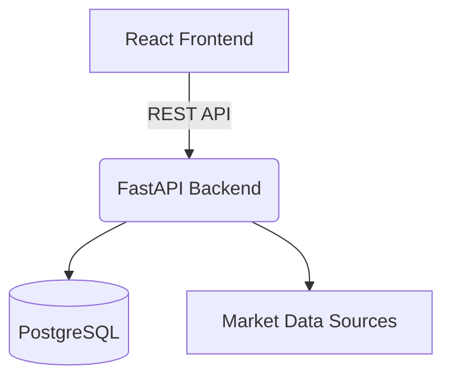
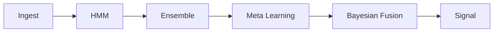
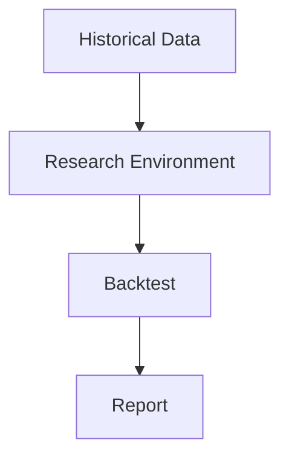
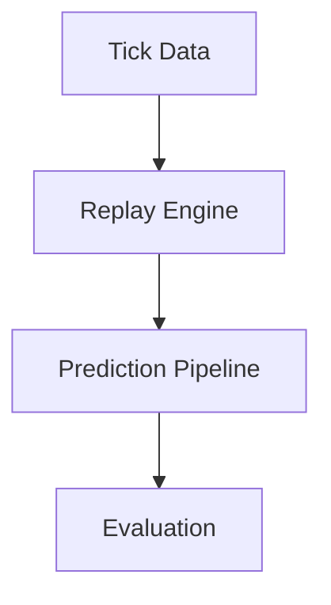
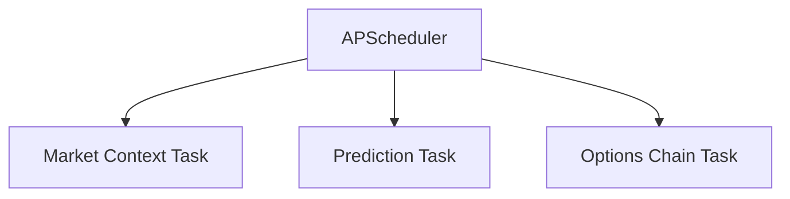
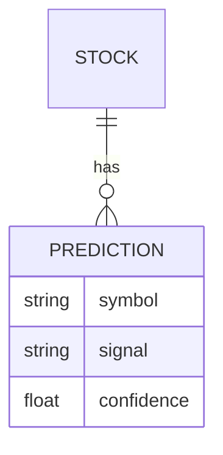
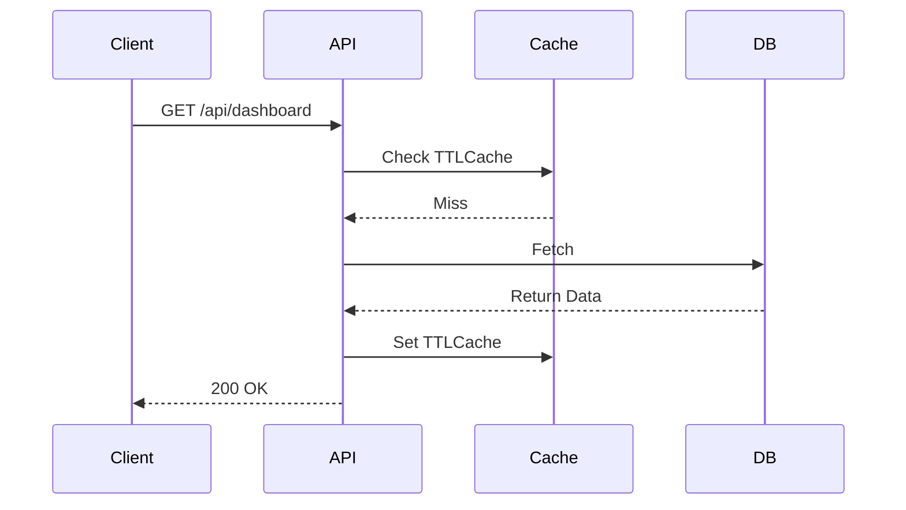
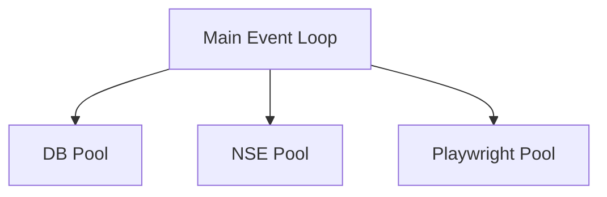

# WealthQuant Architecture Diagrams

## System Architecture

## Prediction Pipeline

## Research Pipeline

## Replay Flow

## Scheduler Flow

## Database ER Diagram

## API Flow

## Thread Pool Diagram

